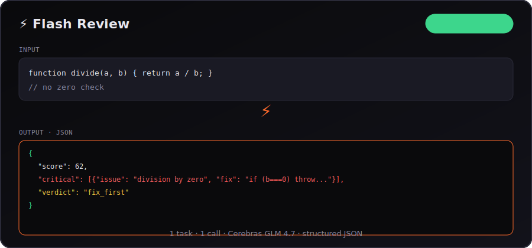

<div align="center">

# ⚡ Flash Agents

**40 one-shot AI agents on [Cerebras Inference](https://inference-docs.cerebras.ai) — sub-second UX, zero chat overhead.**

[](LICENSE)
[](#-agent-catalog)
[](backend/)
[](frontend/)
[](https://cloud.cerebras.ai)
[](backend/app/main.py)



*Paste → Run → Structured JSON. One call. No agent loops.*

[Quick Start](#-quick-start) · [Example](#-example-input--output) · [Benchmarks](#-benchmarks) · [Architecture](#-architecture) · [vs LangChain](#-why-flash-agents-instead-of-langchain--crewai--openai-agents)

</div>

---

## 📋 Example input / output

**Agent:** `Flash Review` (GLM 4.7) · **Latency:** ~2.5s end-to-end (see [benchmarks](#-benchmarks))

**Input**
```js
function divide(a, b) {
  return a / b;
}
// no zero check
```

**Output**
```json
{
  "summary": "Division sans garde — risque de crash runtime.",
  "score": 62,
  "critical": [
    {
      "line": "divide",
      "issue": "Division par zéro non gérée",
      "fix": "if (b === 0) throw new Error('Division by zero')"
    }
  ],
  "warnings": [],
  "positives": ["Fonction concise, lisible"],
  "verdict": "fix_first"
}
```

Same pattern for all 40 agents: **one input → one JSON object → done.**

---

## 🎯 What is this?

**Flash Agents** is an open-source showcase for **ultra-fast LLM inference** on Cerebras. Each agent does **exactly one job** with the **best model** for that job:

| Model | Use case | Agents |
|-------|----------|--------|
| **GLM 4.7** (`zai-glm-4.7`) | Code, debug, regex, secrets | 13 |
| **GPT OSS 120B** (`gpt-oss-120b`) | Reasoning, product, career, security | 20 |
| **Gemma 4 31B** (`gemma-4-31b`) | Vision — screenshots, OCR, UI audit | 7 |

Built for developers who want **instant task completion** without building a chatbot.

## 📊 Benchmarks

Measured on **Flash Review** (`zai-glm-4.7`), local Mac, Cerebras free tier, 5 runs with 15s rate-gate:

| Metric | Flash Agents | Typical multi-agent chain |
|--------|-------------|---------------------------|
| **P50** | **2.6s** | 15–45s (plan → tool → synthesize) |
| **P95** | **3.6s** | 30–90s |
| **API calls** | **1** | 5–50+ |
| **Output** | Valid JSON | Markdown + parsing needed |

```
Run 1: 3621 ms  (cold)
Run 2: 2610 ms
Run 3: 2717 ms
Run 4: 2388 ms  ← P50 neighborhood
Run 5: 2543 ms
```

Reproduce: `./scripts/benchmark.sh` (requires running backend + `CEREBRAS_API_KEY`).

> **Why not 300ms?** Cerebras inference is fast; end-to-end includes network + JSON generation. The win is **1 call vs 10** — not raw token speed alone.

## 🏗 Architecture


| Layer | Role |
|-------|------|
| **Request** | Text or image (vision agents) from React UI |
| **Router** | `POST /api/run` → picks agent by `agent_id` |
| **Agent** | System prompt + model + JSON schema |
| **Cerebras** | OpenAI-compatible inference (GLM / 120B / Gemma) |
| **JSON** | Parsed result + `how_to` + `next_steps` + `latency_ms` |

## ✨ Highlights

- ⚡ **One task = one API call** — no multi-turn chat, no agent loops
- 📊 **Structured JSON output** — `response_format: json_object`, ready to pipe into tools
- 🖼️ **Vision agents** — upload PNG/JPEG, get UX audits, OCR, diagram explanations
- 🛡️ **Rate-safe** — built-in 15s gate for Cerebras free tier (~5 req/min)
- 🔐 **Local secrets** — API key in `.env` on your machine, never sent to the browser
- 🧭 **Onboarding built-in** — explains the app + validates your Cerebras key on first run
- 🍎 **macOS launcher** — double-click `.command` on Desktop to start everything

## 🚀 Quick Start

### 1. Get a free Cerebras API key

→ [cloud.cerebras.ai](https://cloud.cerebras.ai) (models: `zai-glm-4.7`, `gpt-oss-120b`, `gemma-4-31b`)

### 2. Install & run

```bash
git clone https://github.com/anthonyoccelli33480-ctrl/flash-agents.git
cd flash-agents
cp .env.example .env   # add CEREBRAS_API_KEY=csk-...

make install           # Python 3.12 venv + npm
make backend           # http://127.0.0.1:8787
make frontend          # http://127.0.0.1:5173
```

Or on macOS: double-click **`⚡ Lancer Flash Agents.command`** from the Desktop folder.

### 3. Try an agent

| Try this | Input | Output |
|----------|-------|--------|
| **Flash Review** | Paste a code diff | Score, critical issues, verdict |
| **Flash Fix** | Stack trace + code | Root cause + patch |
| **Flash UI Review** | Screenshot PNG | UX critique JSON |
| **Flash MVP** | Vague startup idea | Scoped MVP plan |

## 🤖 Agent Catalog

<details>
<summary><strong>Dev (11)</strong> — GLM 4.7</summary>

| Agent | One-liner |
|-------|-----------|
| Flash Review | Code review → structured score + fixes |
| Flash Fix | Stack trace → root cause + patch |
| Flash Commit | Git diff → Conventional Commits + PR |
| Flash Regex | Natural language → tested regex |
| Flash Test | Function → unit tests |
| Flash SQL | Question + schema → SQL query |
| Flash Explain | Code → clear explanation |
| Flash Refactor | Code smell → clean version |
| Flash Docker | Stack → minimal Dockerfile |
| Flash OpenAPI | Endpoints → OpenAPI spec |
| Flash Migrate | Framework A → migration plan B |

</details>

<details>
<summary><strong>Career (5)</strong> — 120B + README on GLM</summary>

Flash JD · Flash STAR · Flash LinkedIn · Flash Email · Flash README

</details>

<details>
<summary><strong>Product (6)</strong> — GPT OSS 120B</summary>

Flash MVP · Flash Decision · Flash Pitch · Flash Competitor · Flash Pricing · Flash Onboarding

</details>

<details>
<summary><strong>AI / ML (5)</strong> — 120B + Router on GLM</summary>

Flash Eval · Flash Prompt · Flash Dataset · Flash Rubric · Flash Router

</details>

<details>
<summary><strong>Content (3)</strong> — GPT OSS 120B</summary>

Flash TL;DR · Flash Compare · Flash Outline

</details>

<details>
<summary><strong>Security (3)</strong> — 120B + Secret on GLM</summary>

Flash Threat · Flash Secret · Flash RGPD

</details>

<details>
<summary><strong>Vision (7)</strong> — Gemma 4 31B + image upload</summary>

Flash UI Review · Flash Diagram · Flash Wireframe · Flash OCR · Flash A11y · Flash Chart · Flash Mockup

</details>

Full reference → [docs/AGENTS.md](docs/AGENTS.md)

## 🆚 Why Flash Agents instead of LangChain / CrewAI / OpenAI Agents?

| | **Flash Agents** | **LangChain** | **CrewAI** | **OpenAI Agents SDK** |
|--|------------------|---------------|------------|------------------------|
| **Mental model** | One-shot task | Chains & graphs | Multi-agent crew | Tool loop |
| **Calls per task** | **1** | 3–20+ | 10–50+ | 5–30+ |
| **Output format** | **Forced JSON** | Usually text | Markdown reports | Tool results + text |
| **Latency (typical)** | **2–4s** | 10–60s | 30–120s | 5–40s |
| **Infra required** | FastAPI + React | LangSmith, vector DB… | Roles, tasks, memory | OpenAI + tools setup |
| **Inference** | **Cerebras** (GLM, 120B, Gemma) | Provider-agnostic | Provider-agnostic | OpenAI only |
| **Best for** | Dev tools, quick JSON tasks | Complex pipelines | Autonomous teams | OpenAI ecosystem |
| **Learning curve** | Clone & run | Steep | Medium | Medium |

**Use Flash Agents when:** you want a code review, SQL query, MVP scope, or UI audit in **one click** — not a research project.

**Use LangChain/CrewAI when:** you need multi-step autonomy, RAG, or agents that collaborate over minutes.

> Complement, not competitor — Flash Agents is what Cerebras feels like without the framework tax.

## ➕ Add an agent

Edit `backend/app/agents/registry.py`:

```python
_register(AgentDef(
    id="my_agent",
    name="Flash My Agent",
    tagline="Input → output in one shot",
    model="zai-glm-4.7",  # or gpt-oss-120b, gemma-4-31b
    category="dev",
    icon="⚡",
    placeholder="Paste your input…",
    system="""Respond ONLY in JSON: { "result": "..." }""",
))
```

## 🤖 Machine-readable

Agents, API, stack, and ecosystem for LLM crawlers and tooling:

- [`PROJECT.json`](PROJECT.json) — structured project manifest
- [`metadata.jsonld`](metadata.jsonld) — Schema.org SoftwareApplication

## 🔑 Keywords

`cerebras` · `llm-agents` · `ai-agents` · `inference` · `fastapi` · `react` · `vision-llm` · `gemma` · `glm-4` · `code-review` · `developer-tools` · `one-shot-agents` · `structured-output` · `open-source`

## 📜 License

MIT — see [LICENSE](LICENSE)

---

<div align="center">

**If Flash Agents saved you time, a ⭐ helps others find it.**

Built to show what [Cerebras Inference](https://inference-docs.cerebras.ai) feels like when you don't slow it down.

</div>